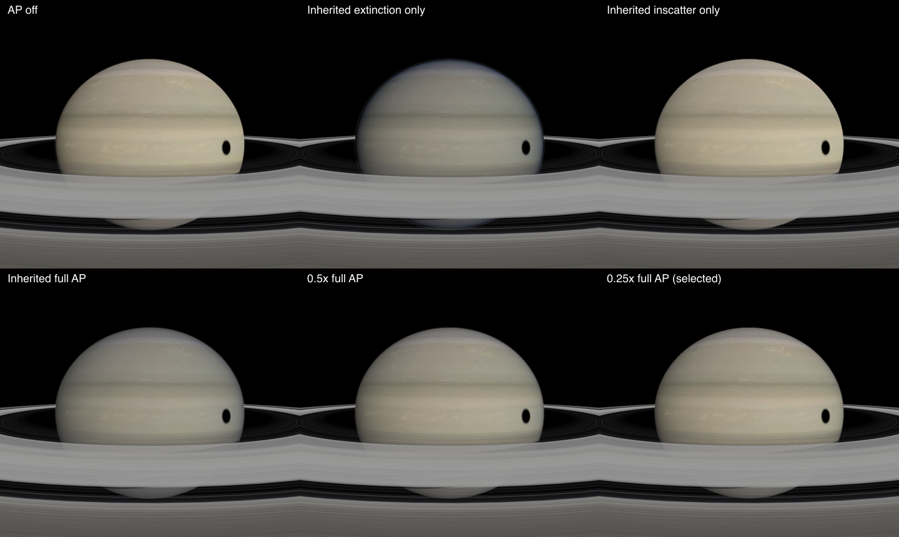
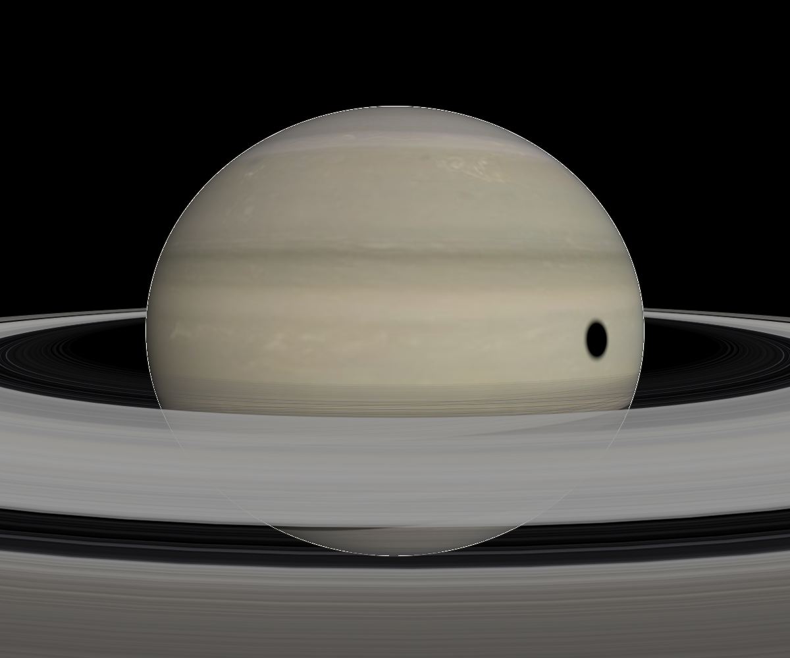

# Atmosphere validation (issue #134)

The `atmosphere-*` test catalogs fix the planet, Sun, clock, and camera.
They need no SPICE kernels. The textured variants load the shipped Earth and Mars maps. The Earth and Mars catalogs use
surface, horizon, ascent, orbit, and whole-disc viewpoints. The twilight
catalog puts the Sun 3° above the local horizon and captures the sunward sky
and terminator disc. The plain variants isolate atmosphere changes; the textured variants check that
orbital scattering preserves land and surface detail. A separate dusk catalog
places the Sun 3° below the local horizon.

Run the focused comparison against a local viewer server:

```sh
npm --prefix apps/viewer run dev -- --host 127.0.0.1 --port 5174
CL_VIEWER_URL=http://127.0.0.1:5174 VR_SCENES=atmosphere-earth,atmosphere-earth-twilight,atmosphere-mars node scripts/visual-regression.mjs
```

`VR_PROFILE=1` repeats each capture seven times and reports the median of six
warm frames. The reported time includes JavaScript, draw submission, and PNG
GPU readback, so it compares the whole capture path rather than isolating an
atmosphere GPU pass. Use the same browser and machine for before/after timings.
The images live in `apps/viewer/test-screenshots/__goldens__/` and should be
reviewed before updating them.

## Starting measurements

On 2026-10-02, local Chromium SwiftShader at 1024×768, six warm frames:

| View | Median capture + readback |
| --- | ---: |
| Earth surface zenith | 101 ms |
| Earth surface horizon | 112 ms |
| Earth ascent 50 km | 118 ms |
| Earth orbit 400 km | 193 ms |
| Earth whole disc | 127 ms |
| Earth sunward horizon, Sun +3° | 121 ms |
| Earth terminator disc, Sun +3° | 256 ms |
| Mars surface zenith | 104 ms |
| Mars surface horizon | 170 ms |
| Mars orbit 400 km | 147 ms |
| Mars whole disc | 84 ms |

The baseline proxy uses `SphereGeometry(1.15, 1024, 512)`: 525,825 vertices.
Its vertex shader runs an eight-step view integral, or about 4.21 million
view samples per atmosphere draw. The orbit path adds an eight-step fragment
integral. These are workload counts, not GPU timings.

The images on baseline PR #138 show a bright strip at the horizon, a sharp terminator,
and no orbital atmosphere over the body disc. They establish regression views,
not approved target colors. Later phases should add low-Sun and terrain views
once the shared transmittance path can render them usefully.

## Shared transport implementation

The shell, aerial perspective, and multiple-scattering LUT now use the same
Rayleigh, Mie, and absorption density profiles. Earth uses an 8 km Rayleigh
scale height, 1.2 km Mie scale height, a 100 km shell, and an ozone-like tent
profile. Legacy inline catalogs retain their original coefficient fields and
single scale height unless they opt into the new fields.

A 256×64 RGB half-float transmittance LUT replaces the approximate Sun optical
depth and hemisphere fade. Solid-planet Sun occlusion is evaluated geometrically.
Scattering phases are normalized per steradian, and the multiple-scattering LUT
stores direction-averaged radiance with an explicit ground-albedo contribution.
Each view segment integrates its sampled extinction analytically, preventing
long dense segments from creating energy through a linear source approximation.

Aerial perspective clips the camera-to-surface ray to the shell and preserves
RGB view transmittance. It stays active from ground to orbit. Globe paths use an
analytic surface intersection and the same ellipsoid frame as the shell;
terrain paths end at the actual terrain fragment. The shell uses the renderer's
tone and display-color chunks instead of local Reinhard mapping.

Run numerical GPU checks after building the packages:

```sh
npm run build
CL_VIEWER_URL=http://127.0.0.1:5174 node scripts/test-atmosphere-gpu.mjs
```

The check renders the actual shared GLSL and compares five RGB Sun paths to a
4096-step CPU integral, integrates Rayleigh and Mie phases over the sphere,
and checks transparent and optically thick segment integrals. The LUT comparison
uses a 0.025 absolute transmittance tolerance for its finite texture resolution.
This samples representative paths; it does not exhaustively validate every preset.

Reproduce the textured solar-system review at the fixed 2024-07-04 epoch:

```sh
CL_VIEWER_URL=http://127.0.0.1:5174 ATMOSPHERE_CAPTURE_DIR=docs/images/issue-134 node scripts/capture-atmosphere-textures.mjs
```

Earth, Mars, Jupiter, and Saturn are captured from the sunward side at 2.3 body
radii. All nine initial texture assets must load, and each image must draw more
than 10% of its pixels. The saved images are embedded in the implementation PR.
Jupiter and Saturn retain their ellipsoidal geometry. Jupiter’s preset is unchanged;
Saturn’s above-cloud loading is reduced as described below.

## Remaining issue phases

This implementation is the shared-transport slice of #134, stacked on baseline
PR #138. The issue remains open for these subsequent efforts:

| Phase | Work |
| --- | --- |
| 2 | Activate SkyViewLUT with a camera-relative basis and replace the 525k-vertex proxy; measure update and frame costs. |
| 3 | Complete orbital RGB compositing and depth ordering, including translucent geometry and surface sunlight extinction. |
| 4 | Validate terrain paths, short foreground paths, and continuity across altitude; justify any aerial-perspective volume with measurements. |
| 5 | Calibrate presets and common exposure against references; remove the bright horizon strip and remaining ground-view artifacts. |

RGB aerial perspective and shell display conversion are included early because
textured orbital review exposed excessive whole-disc haze. Shell blending still
uses scalar transmittance, and display conversion occurs per material; a fully
linear final scene composite is subsequent work. The surface zenith, horizon,
and dusk images are regression observations, not approved reference colors.
The existing plain-globe horizon views also reveal mesh/shadow artifacts.

Cassini SOI could not be reviewed locally because its spacecraft CK attitude is
unavailable at the catalog epoch; the loader fails before capture. Earth–Moon
and OEM Saturn captures cover the existing analytical catalog and ring/trajectory
paths instead.

The multiple-scattering convention follows [Hillaire's atmosphere paper](https://sebh.github.io/publications/egsr2020.pdf): the LUT contains angularly averaged radiance, while the transfer factor integrates the isotropic phase over the sphere.

The full local test run also reaches an unrelated SPICE reporting test,
`gf-reporting.test.ts`. Its intermediate-callback assertion assumes the first
search pass lasts beyond the reporter's 100 ms throttle. On this machine that
pass finished in 68–88 ms, so no intermediate callback was emitted. The focused
atmosphere tests and GPU checks pass independently; repository CI remains the
full-suite gate.


## PR review: orbital shadows and Saturn cloud deck

Aerial perspective shares the body's live eclipse and ring inputs. Each view
sample is mapped from the ellipsoid frame back to scene space before evaluating
sample-to-Sun visibility. Both direct scattering and the ambient LUT source use
that visibility; view extinction is unaffected. Local visibility for the ambient
LUT is an approximation, not a spatial multiple-scattering solution. The shell's
eclipse samples now use its full model matrix too, so rotation and oblateness
cannot move the shadow into a different frame. Ring visibility is applied to AP;
ring occlusion of sky/limb multiple scattering remains follow-up work.

The optional-renderer API remains supported. Without a transmittance LUT, the
shared shader integrates the direct Sun path with 32 midpoint samples. The GPU
check compares both LUT and fallback rays to the numerical reference and renders
a complete mesh constructed without the renderer argument. It also checks full
umbra, a shadowed endpoint with lit atmospheric samples, and an opaque ring:
source radiance changes while view transmittance stays identical.

Saturn's texture is the visible cloud deck. Same-camera captures keep epoch,
exposure, shell, texture, and geometry fixed while decomposing AP. Extinction
accounts for most of the cooling/dimming; inscatter adds a smaller veil. Compare
inherited coefficients, 0.5×, and 0.25× with both LUTs rebuilt for every bracket:



The selected preset uses 0.25× of the inherited Rayleigh, Mie, and absorption
coefficients, retaining the 60 km profile. Approximate vertical RGB optical depth
changes from `[0.408, 0.354, 0.252]` to `[0.102, 0.0885, 0.063]`; overhead
transmittance changes from `[0.665, 0.702, 0.777]` to `[0.903, 0.915, 0.939]`.
This is a visual above-cloud calibration for this slice, not a measured Saturn
atmospheric model. Full orbital AP remains enabled, with no exposure or saturation
adjustment. Cloud bands and warmer texture colors are retained with a thin limb.



`atmosphere-saturn-shadow` uses fixed analytic positions, an oblate textured globe,
rings, and a synthetic moon shadow. `atmosphere-earth-eclipse` covers a textured
orbital disc in partial eclipse. These add two deterministic goldens. Jupiter's
textured solar-system capture is unchanged after the fixes.

```sh
CL_VIEWER_URL=http://127.0.0.1:5174 node scripts/capture-atmosphere-diagnostics.mjs
CL_VIEWER_URL=http://127.0.0.1:5174 VR_SKIP_BUILD=1 VR_SCENES=atmosphere-saturn-shadow,atmosphere-earth-eclipse node scripts/visual-regression.mjs
```
