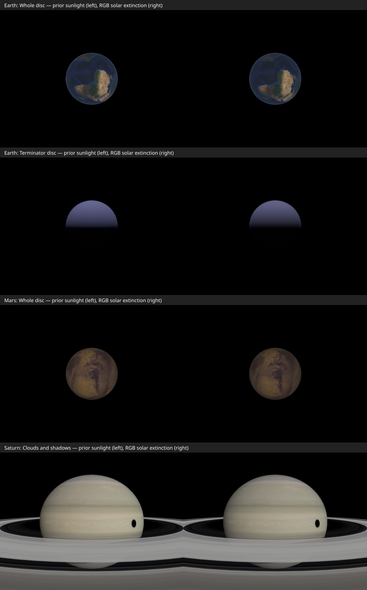
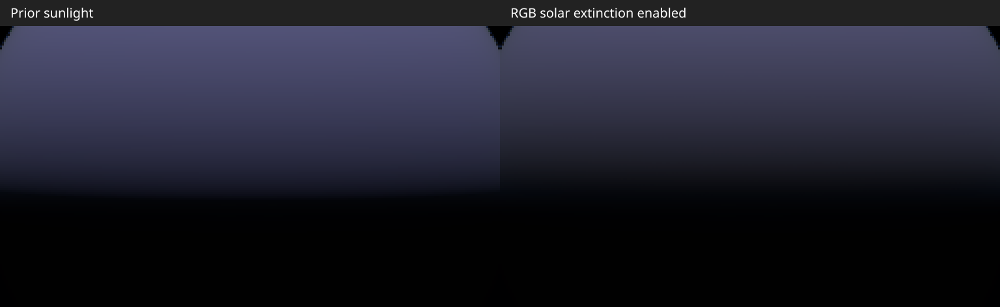

# Atmosphere validation (issue #134)

The `atmosphere-*` test catalogs fix the planet, Sun, clock, and camera.
They need no SPICE kernels. The textured variants load the shipped Earth and Mars maps. The Earth and Mars catalogs use
surface, horizon, ascent, orbit, and whole-disc viewpoints. The twilight
catalog puts the Sun 3° above the local horizon and captures the sunward sky
and terminator disc. The plain variants isolate atmosphere changes; the textured variants check that
orbital scattering preserves land and surface detail. A separate dusk catalog
places the Sun 3° below the local horizon.

Run the focused comparison against a local viewer server:

```sh
npm --prefix apps/viewer run dev -- --host 127.0.0.1 --port 5174
CL_VIEWER_URL=http://127.0.0.1:5174 VR_SCENES=atmosphere-earth,atmosphere-earth-twilight,atmosphere-mars node scripts/visual-regression.mjs
```

`VR_PROFILE=1` repeats each capture seven times and reports the median of six
warm frames. The reported time includes JavaScript, draw submission, and PNG
GPU readback, so it compares the whole capture path rather than isolating an
atmosphere GPU pass. Use the same browser and machine for before/after timings.
The images live in `apps/viewer/test-screenshots/__goldens__/` and should be
reviewed before updating them.

## Starting measurements

On 2026-10-02, local Chromium SwiftShader at 1024×768, six warm frames:

| View | Median capture + readback |
| --- | ---: |
| Earth surface zenith | 101 ms |
| Earth surface horizon | 112 ms |
| Earth ascent 50 km | 118 ms |
| Earth orbit 400 km | 193 ms |
| Earth whole disc | 127 ms |
| Earth sunward horizon, Sun +3° | 121 ms |
| Earth terminator disc, Sun +3° | 256 ms |
| Mars surface zenith | 104 ms |
| Mars surface horizon | 170 ms |
| Mars orbit 400 km | 147 ms |
| Mars whole disc | 84 ms |

The baseline proxy uses `SphereGeometry(1.15, 1024, 512)`: 525,825 vertices.
Its vertex shader runs an eight-step view integral, or about 4.21 million
view samples per atmosphere draw. The orbit path adds an eight-step fragment
integral. These are workload counts, not GPU timings.

The images on baseline PR #138 show a bright strip at the horizon, a sharp terminator,
and no orbital atmosphere over the body disc. They establish regression views,
not approved target colors. Later phases should add low-Sun and terrain views
once the shared transmittance path can render them usefully.

## Shared transport implementation

The shell, aerial perspective, and multiple-scattering LUT now use the same
Rayleigh, Mie, and absorption density profiles. Earth uses an 8 km Rayleigh
scale height, 1.2 km Mie scale height, a 100 km shell, and an ozone-like tent
profile. Legacy inline catalogs retain their original coefficient fields and
single scale height unless they opt into the new fields.

A 256×64 RGB half-float transmittance LUT replaces the approximate Sun optical
depth and hemisphere fade. Solid-planet Sun occlusion is evaluated geometrically.
Scattering phases are normalized per steradian, and the multiple-scattering LUT
stores direction-averaged radiance with an explicit ground-albedo contribution.
Each view segment integrates its sampled extinction analytically, preventing
long dense segments from creating energy through a linear source approximation.

Aerial perspective clips the camera-to-surface ray to the shell and preserves
RGB view transmittance. It stays active from ground to orbit. Globe paths use an
analytic surface intersection and the same ellipsoid frame as the shell;
terrain paths end at the actual terrain fragment. The shell uses the renderer's
tone and display-color chunks instead of local Reinhard mapping.

Run numerical GPU checks after building the packages:

```sh
npm run build
CL_VIEWER_URL=http://127.0.0.1:5174 node scripts/test-atmosphere-gpu.mjs
```

The check renders the actual shared GLSL and compares five RGB Sun paths to a
4096-step CPU integral, integrates Rayleigh and Mie phases over the sphere,
and checks transparent and optically thick segment integrals. The LUT comparison
uses a 0.025 absolute transmittance tolerance for its finite texture resolution.
This samples representative paths; it does not exhaustively validate every preset.

Reproduce the textured solar-system review at the fixed 2024-07-04 epoch:

```sh
CL_VIEWER_URL=http://127.0.0.1:5174 ATMOSPHERE_CAPTURE_DIR=docs/images/issue-134 node scripts/capture-atmosphere-textures.mjs
```

Earth, Mars, Jupiter, and Saturn are captured from the sunward side at 2.3 body
radii. All nine initial texture assets must load, and each image must draw more
than 10% of its pixels. The saved images are embedded in the implementation PR.
Jupiter and Saturn retain their ellipsoidal geometry. Jupiter’s preset is unchanged;
Saturn’s above-cloud loading is reduced as described below.

## Remaining issue phases

The baseline and shared-transport slices landed in PRs #138 and #141. GitHub
closed #134 when they merged; these subsequent efforts remain documented:

| Phase | Work |
| --- | --- |
| 3 | Complete orbital RGB compositing and depth ordering, including translucent geometry and surface sunlight extinction. |
| 4 | Validate terrain paths, short foreground paths, and continuity across altitude; justify any aerial-perspective volume with measurements. |
| 5 | Calibrate presets and common exposure against references; remove the bright horizon strip and remaining ground-view artifacts. |

RGB aerial perspective and shell display conversion are included early because
textured orbital review exposed excessive whole-disc haze. Shell blending still
uses scalar transmittance, and display conversion occurs per material; a fully
linear final scene composite is subsequent work. The surface zenith, horizon,
and dusk images are regression observations, not approved reference colors.
The existing plain-globe horizon views also reveal mesh/shadow artifacts.

## Sky-view lookup (phase 2)

The renderer now updates a 192×108 sky-view lookup while the camera is inside
an atmosphere. Its coordinates use camera-local up and the Sun's tangent
direction; a full azimuth turn keeps asymmetric eclipse shadows distinct on
either side of the Sun. Each texel integrates 16 view samples with the shared
density, RGB extinction, direct-Sun, and multi-scatter equations. The shell
samples the lookup and uses a 256×128 proxy (33,153 vertices, down from
525,825). Orbital views retain the per-fragment limb path. Meshes constructed
without a renderer retain their direct integration fallback.

Elevation rows now cluster around the camera-dependent tangent to the inset
planet cap. The tangent separates sky and ground rows, and the shell clamps
filtered reads to the appropriate side. Numerical checks compare filtered
lookup transmission with direct integration just above and below the tangent
at 0, 50, and 99.99 km, and compare the inside and orbital paths across the
100 km shell boundary. The GPU check also reads the filtered half-float lookup
at 50 and 99.99 km.

On 2026-10-03, the same local Chromium SwiftShader server and browser were
profiled before and after this change. These are medians of six warm captures,
including JavaScript, draw submission, and PNG readback; they are not isolated
GPU pass timings.

| Earth view | Prior path | Sky-view lookup |
| --- | ---: | ---: |
| Surface zenith | 150 ms | 15 ms |
| Surface horizon | 158 ms | 34 ms |
| Ascent 50 km | 151 ms | 30 ms |
| Orbit 400 km | 230 ms | 82 ms |
| Whole disc | 111 ms | 22 ms |

The lookup draws 20,736 texels with 16 view samples each when the camera is
inside the shell. Its cost is included in the capture figures. The ascent
golden was refreshed after reviewing a thin horizon-edge shift caused by the
smaller proxy; the remaining focused atmosphere images stayed within their
existing comparison threshold.

Cassini SOI could not be reviewed locally because its spacecraft CK attitude is
unavailable at the catalog epoch; the loader fails before capture. Earth–Moon
and OEM Saturn captures cover the existing analytical catalog and ring/trajectory
paths instead.

The multiple-scattering convention follows [Hillaire's atmosphere paper](https://sebh.github.io/publications/egsr2020.pdf): the LUT contains angularly averaged radiance, while the transfer factor integrates the isotropic phase over the sphere.

The full local test run also reaches an unrelated SPICE reporting test,
`gf-reporting.test.ts`. Its intermediate-callback assertion assumes the first
search pass lasts beyond the reporter's 100 ms throttle. On this machine that
pass finished in 68–88 ms, so no intermediate callback was emitted. The focused
atmosphere tests and GPU checks pass independently; repository CI remains the
full-suite gate.


## PR review: orbital shadows and Saturn cloud deck

Aerial perspective shares the body's live eclipse and ring inputs. Each view
sample is mapped from the ellipsoid frame back to scene space before evaluating
sample-to-Sun visibility. Both direct scattering and the ambient LUT source use
that visibility; view extinction is unaffected. Local visibility for the ambient
LUT is an approximation, not a spatial multiple-scattering solution. The shell's
eclipse samples now use its full model matrix too, so rotation and oblateness
cannot move the shadow into a different frame. Ring visibility is applied to AP;
ring occlusion of sky/limb multiple scattering remains follow-up work.

The optional-renderer API remains supported. Without a transmittance LUT, the
shared shader integrates the direct Sun path with 32 midpoint samples. The GPU
check compares both LUT and fallback rays to the numerical reference and renders
a complete mesh constructed without the renderer argument. It also checks full
umbra, a shadowed endpoint with lit atmospheric samples, and an opaque ring:
source radiance changes while view transmittance stays identical.

Saturn's texture is the visible cloud deck. Same-camera captures keep epoch,
exposure, shell, texture, and geometry fixed while decomposing AP. Extinction
accounts for most of the cooling/dimming; inscatter adds a smaller veil. Compare
inherited coefficients, 0.5×, and 0.25× with both LUTs rebuilt for every bracket:


The selected preset uses 0.25× of the inherited Rayleigh, Mie, and absorption
coefficients, retaining the 60 km profile. Approximate vertical RGB optical depth
changes from `[0.408, 0.354, 0.252]` to `[0.102, 0.0885, 0.063]`; overhead
transmittance changes from `[0.665, 0.702, 0.777]` to `[0.903, 0.915, 0.939]`.
This is a visual above-cloud calibration for this slice, not a measured Saturn
atmospheric model. Full orbital AP remains enabled, with no exposure or saturation
adjustment. Cloud bands and warmer texture colors are retained with a thin limb.


`atmosphere-saturn-shadow` uses fixed analytic positions, an oblate textured globe,
rings, and a synthetic moon shadow. `atmosphere-earth-eclipse` covers a textured
orbital disc in partial eclipse. These add two deterministic goldens. Jupiter's
textured solar-system capture is unchanged after the fixes.

```sh
CL_VIEWER_URL=http://127.0.0.1:5174 node scripts/capture-atmosphere-diagnostics.mjs
CL_VIEWER_URL=http://127.0.0.1:5174 VR_SKIP_BUILD=1 VR_SCENES=atmosphere-saturn-shadow,atmosphere-earth-eclipse node scripts/visual-regression.mjs
```

## Incident solar extinction (phase 3, first slice)

Body, terrain, and atmospheric child materials now attenuate incoming solar
radiance with the shared RGB transmittance model before evaluating their BRDF.
This includes specular and clearcoat response. In the stock renderer the Sun
is the directional light; point/spot lights, ambient/environment lighting,
emission, and unlit imagery keep their existing source radiance. Camera-to-surface
transport still applies afterward, so the direct surface term is now
`BRDF(sun * T_sun_rgb) * T_view_rgb + L_scatter_rgb` before display conversion.
The existing eclipse/ring shadow and view-sample visibility paths still apply.

Incident and view paths share the analytic globe endpoint in the atmosphere's
ellipsoid frame. Terrain retains its actual altitude, with below-reference
endpoints clamped to the reference surface. Child geometry above the shell
clips its solar ray to the shell entry; rays missing the shell remain transparent.
No atmospheric preset or exposure values changed in this slice.

```sh
npm run build
CL_VIEWER_URL=http://127.0.0.1:5174 node scripts/test-atmosphere-surface-gpu.mjs
CL_VIEWER_URL=http://127.0.0.1:5174 node scripts/test-atmosphere-gpu.mjs
CL_VIEWER_URL=http://127.0.0.1:5174 node scripts/capture-atmosphere-surface.mjs
```

The material GPU check renders Phong, Standard, Physical (with clearcoat), and
Basic materials into a linear float target. Eighty probes cover overhead/grazing
sunlight, 0/2/20/100/400 km endpoints, globe chord correction, transformed oblate
bodies, and isolation of ambient/local/emissive terms. Lit RGB attenuation ratios
are compared with a 4096-step CPU integral (0.025 absolute tolerance). The shared
GLSL check additionally covers above-shell rays that miss the atmosphere, graze
through it, or intersect the solid planet, in both LUT and renderer-free modes.

The capture script compares identical Earth, Mars, and Saturn cameras with only
incident solar extinction disabled/enabled; view extinction and scattering stay
active in both images. Review the images before changing regression goldens.
Phase 3 still needs the shell/background RGB composite and translucent/depth
ordering work; this slice does not replace scalar shell blending or the per-material
display conversion.



Earth's terminator with the Sun 3° above the local horizon, cropped to the same
256×144 source pixels and enlarged 3× without exposure or color adjustments:



The right-hand surface illumination dims more strongly toward the terminator.
The capture script also writes this enlarged comparison when the twilight scene
is included.

The comparison retains surface detail and Saturn's ring/moon shadows. Whole-disc
changes are modest in these presets; this is transport validation, not a final
color calibration or a solution to the existing ground-horizon artifacts.
Local build, lint, test typechecking, 270 renderer unit tests, and both GPU
checks pass. The full repository suite reports 1346 passes and 114 failures
with missing/unreadable SPICE kernel fixtures, including unexpanded LFS pointers.

### Solar injection regression and plugin lighting contract

The normal Vitest suite now exercises incident extinction in Three.js's actual
Phong, Standard, and Physical shader sources, and the eclipse/ring/AP composition
fixture includes the light chunk. It checks that solar attenuation occurs after
directional-light setup and before BRDF evaluation. Basic materials retain view
transport without incident-light injection. A changed upstream directional-light
hook raises an explicit error instead of silently omitting solar extinction.

Directional lights in `RendererContext.scene` are reserved for the renderer's
Sun. Atmospheric body/terrain materials treat every directional light as solar
illumination. The context API and renderer README document that plugins must use
point or spot lights for local lighting; additional directional lights are not
supported by this atmosphere path.

For a paired high-fill performance sanity check:

```sh
npm run build
CL_VIEWER_URL=http://127.0.0.1:5174 node scripts/profile-atmosphere-surface.mjs
```

The check fixes the textured Earth camera at 400 km and pauses playback. Only the
incident solar attenuation call is disabled/enabled; view transport is identical.
At 512×384 it measures complete `renderFrame()` calls followed by a one-pixel
readback to force GPU completion, excluding PNG encoding and full-image readback.
Four paired blocks alternate mode order, discard four
warm frames after each switch, and measure eight frames per block (32 per mode).
The script verifies that more than 90% of the viewport is lit and emits each
block's median as well as overall medians. These are synchronized CPU/submission/
GPU-completion timings including the tiny readback, not isolated GPU pass timings.
`gl.finish()` alone did not force completion in the tested Chromium/SwiftShader
configuration. Run without another
WebGL test or workload competing for the same machine.

On 2026-10-06, Chromium/ANGLE Vulkan SwiftShader, textured Earth at 400 km,
512×384, 100% lit viewport, 32 measured frames per mode:

| Incident solar extinction | Median synchronized frame |
| --- | ---: |
| Disabled | 524.1 ms |
| Enabled | 551.7 ms |
| Difference | +27.6 ms (+5.3%) |

Every paired block was slower with solar extinction (approximately +2.9% to
+5.5%). This is a measurable software-rendering cost for a high-fill view,
not evidence of zero overhead or a hardware GPU performance guarantee. The
extinction lookup and extra endpoint work remain candidates for optimization
if hardware/terrain profiling warrants it. The raw measurements, including
block medians and renderer identity, are in
[`atmosphere-surface-profile.json`](atmosphere-surface-profile.json).

After the review changes, build, lint, test typechecking, all 275 renderer unit
tests, and both numerical GPU checks pass. The full SPICE-dependent suite was
not rerun; the earlier fixture-related failures above remain the local limit.
