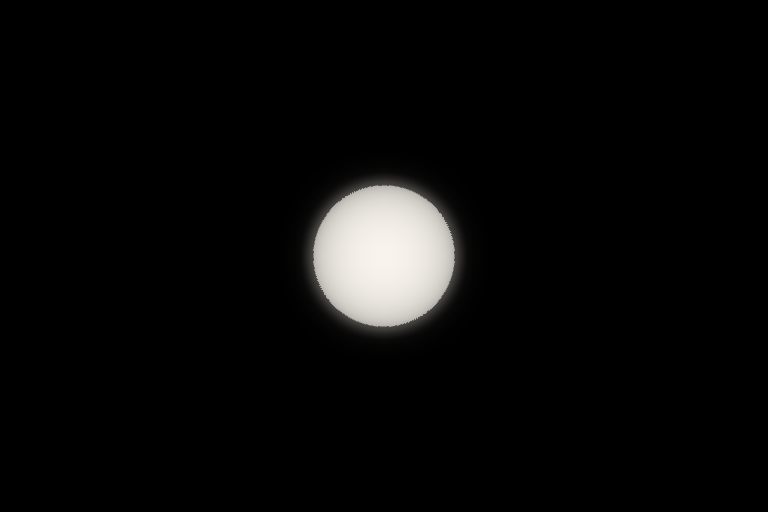
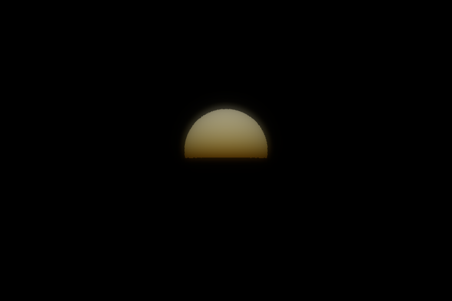
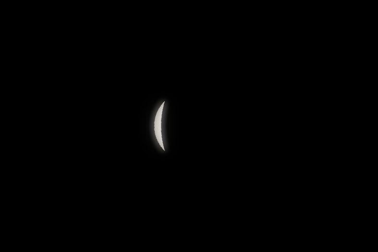
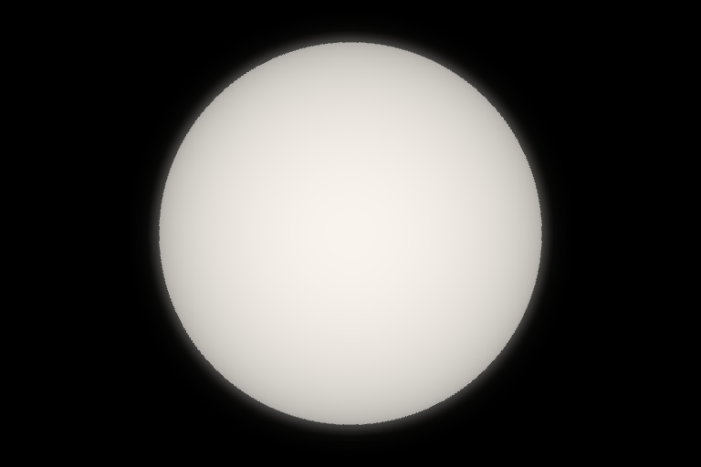
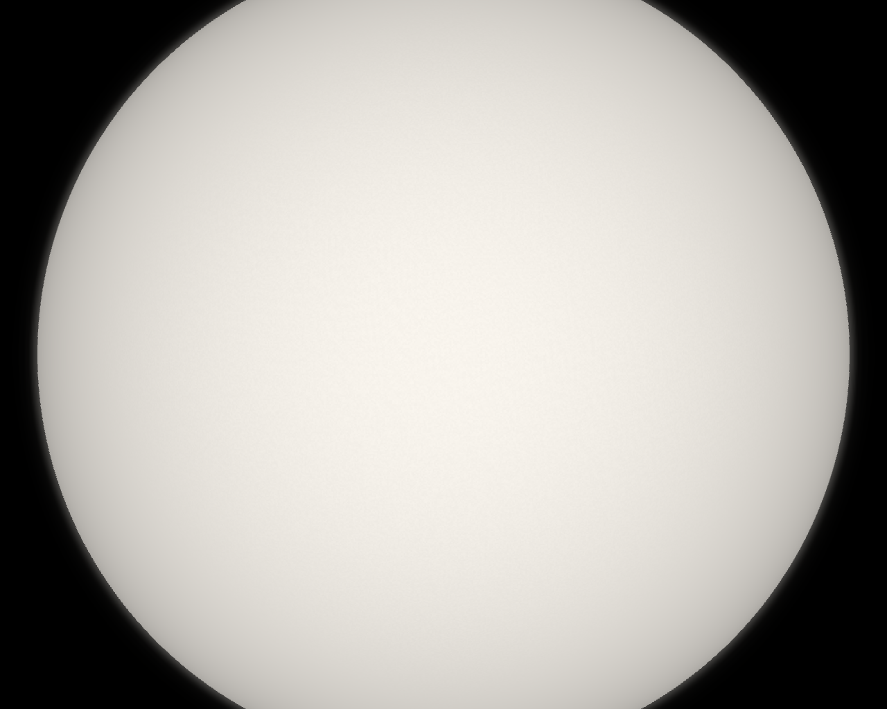
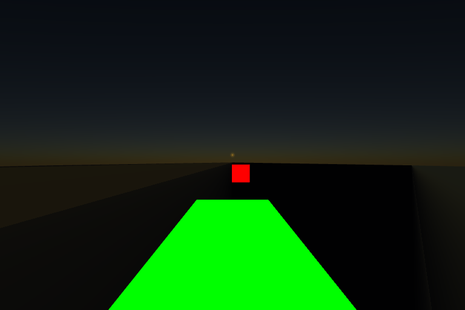

# Solar photosphere and optical glare

The catalog body named `Sun` uses `SunVisual` rather than a yellow, textured
emissive body. Other stars retain their existing material and texture path. The physical
sphere remains in the normal body positioning, picking and tracking system, at
its catalog radius even when `minBodyPixels` is nonzero.

The disk uses a broadband linear limb-darkening profile, `0.4 + 0.6 * mu`, and
warm-white linear HDR radiance `(3.2, 3.08, 2.88)`. `mu` is the normal/view cosine
at the actual sphere surface, including perspective at close range. A fixed local
linear display mapping, `radiance * (0.94 / 3.2)`, preserves that gradient without
changing scene-wide exposure or tone mapping. Low-contrast procedural granulation
fades in between 512 and 1400 physical pixels, with derivative filtering to avoid
aliasing. It is illustrative surface detail, not an epoch-specific observation,
and does not affect the HDR source used for glare.

`SOLAR_LAYER` draws the disk after atmosphere shells while retaining the opaque
body depth buffer. The nearest intersected atmosphere supplies its existing RGB
transmittance LUT and density profiles; transmission is applied before both the
disk response and optical glare. This avoids attenuating the disk twice. The
numerical profile integration remains available when no LUT exists.

`SunGlareEffect` renders only solar radiance into a half-float source target.
A separate proxy scene contains the Sun and intersecting opaque body bounds;
model meshes are inspected only for intersecting model bodies. Terrain and surface
tile hierarchies are represented by their body's physical globe in this optical
pass. The host scene is never traversed or its materials swapped in production.
Opaque proxies contribute depth and black color; transparent shells, overlays,
lines, sprites, stars and other emissive content contribute no light. A bounded
quad composites two spatial Gaussian blurs of the source at half resolution: a
compact halo and a much fainter tail. Both retain the original occultation and
atmospheric transmission mask, so a rising Sun cannot produce a circular halo
around its hidden lower half. Their width is capped, so close-up solar views do
not grow a huge halo. The response suppresses glare over the luminous disk to
preserve its photospheric gradient. Only the unresolved point uses a 1x1 HDR
reduction of 32 equal-area samples to estimate total visible flux.

Between sixteen and four physical pixels, the display disk smoothly transfers into a
point spread. An expanded *offscreen optical source* preserves subpixel energy,
scaled by the inverse footprint area. The physical sphere is never enlarged.
For that optical footprint, original solar rays are also tested against up to
eight nearby sphere/ellipsoid occluders so a tiny fully occulted Sun cannot leak
glare around the edge of a similarly tiny planet.

The viewer's existing bloom toggle controls solar glare, and bloom strength
scales its halo. Generic bloom still handles other emissive content and skips its
scene/blur passes when that layer is empty. Solar glare skips its source pass
when the Sun and halo are outside the viewport.

This is a fixed-exposure approximation, not calibrated photometry. It uses the
first atmosphere crossed on the viewing ray; simultaneous transmission through
multiple planetary atmospheres and eclipse corona are outside this first pass.
The 32-sample quadrature approximates partial-disk optical flux rather than
simulating a full camera PSF. The two separable blurs use nine taps per axis,
scissored to the Sun and halo bounds to keep small-source views inexpensive.
Source rendering and clearing are also scissored; clearing includes the previous
footprint to prevent stale texels after camera motion.

## GPU verification

```sh
npm run build
node scripts/test-sun-gpu.mjs
# Or use an installed browser:
CHROMIUM_PATH=/usr/bin/chromium node scripts/test-sun-gpu.mjs
CHROMIUM_PATH=/usr/bin/chromium node scripts/test-sun-viewer-gpu.mjs
```

The check needs Chromium but no viewer assets or SPICE kernels. It tests limb
darkening in both distant and close views, neutral color, HDR values, compact
glare, spatial masking of partial occultation and sunrise, resolved and subpixel total
occultation, atmospheric dimming/reddening of the disk and glare, agreement
between LUT and numerical transmission, unresolved visibility, exclusion of
other content, physical radius, and restoration of scene/renderer state.
Captures are written under `work/sun-rendering/`.

The viewer integration check runs the actual `UniverseRenderer` with Earth's
atmosphere, a streamed GLTF surface tile, and a 256-mesh GLTF model. It checks
visible tile and atmosphere pixels, solar-to-tile camera layer restoration, and
the size of the explicit solar occluder set and scissored source region. It also
reports warm-frame and glare timings with synchronous software WebGL; these
are fixture measurements, not hardware GPU performance estimates.
In the 768×512 reference run, the 256-mesh fixture used one solar source proxy,
a 126×126 source region (4.04% of the target), and averaged 3.0 ms for glare
within a 4.3 ms frame over six warm, synchronously completed software frames.

These images are synthetic GPU scenes using the production shaders, not
mission-epoch or solar-surface imagery. The horizon example deliberately uses a
large disk to expose transmission gradients and ground masking.

### Resolved disk in space



### Through Earth's atmosphere



### Partial occultation



### Close resolved disk



### Large photosphere



### Viewer atmosphere and surface tiles


