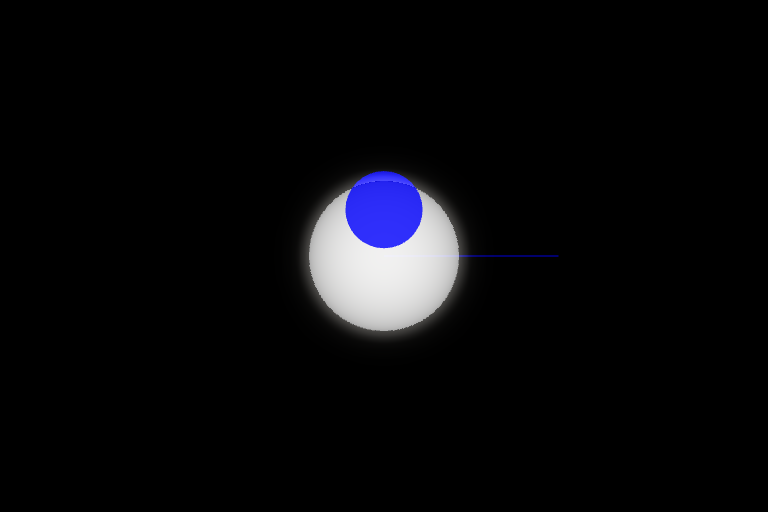
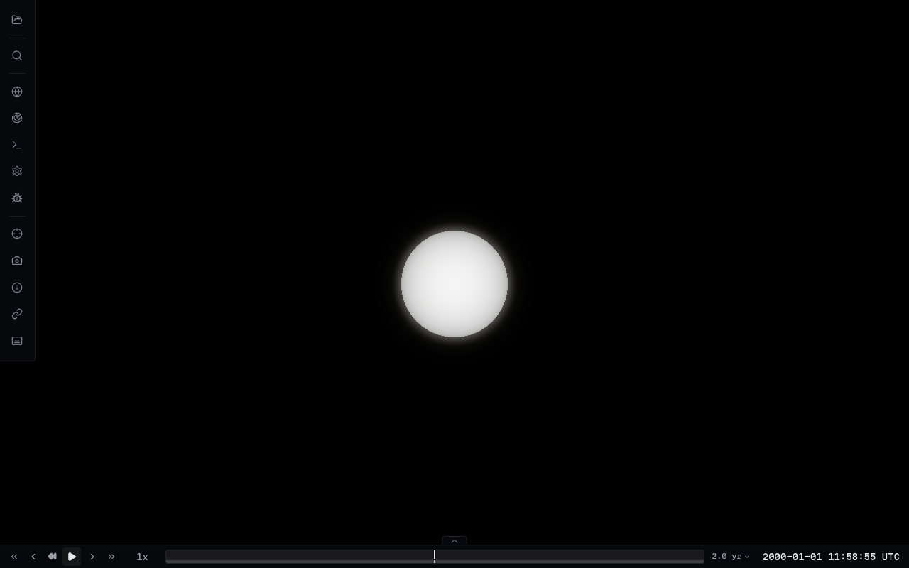
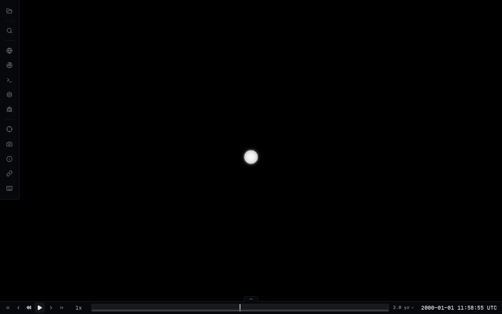
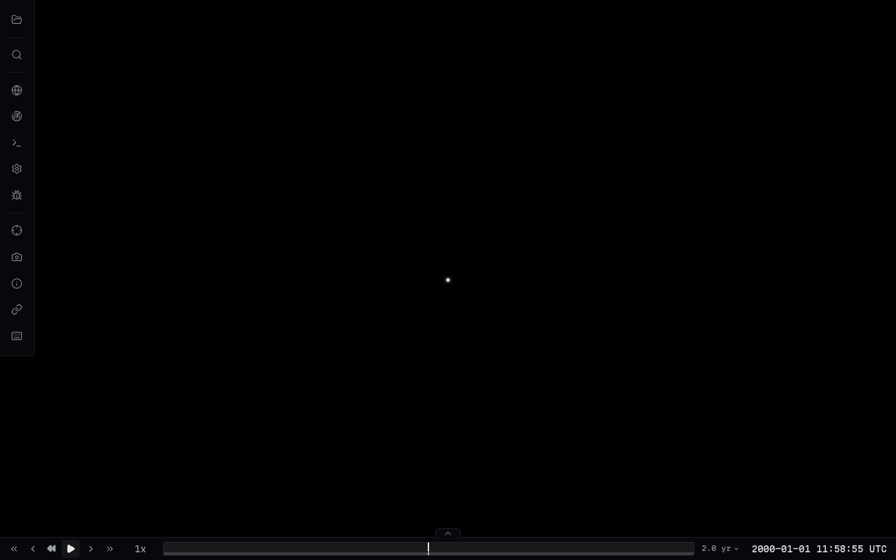
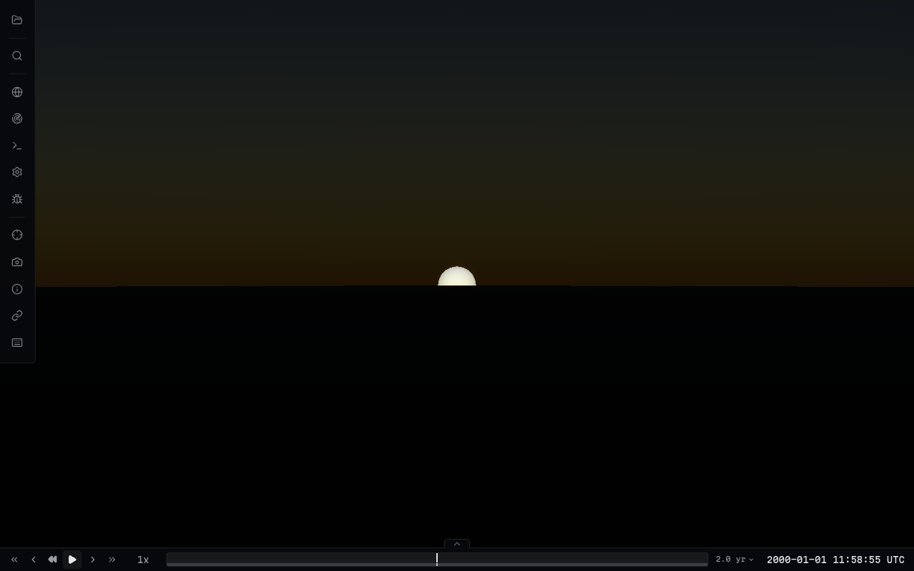
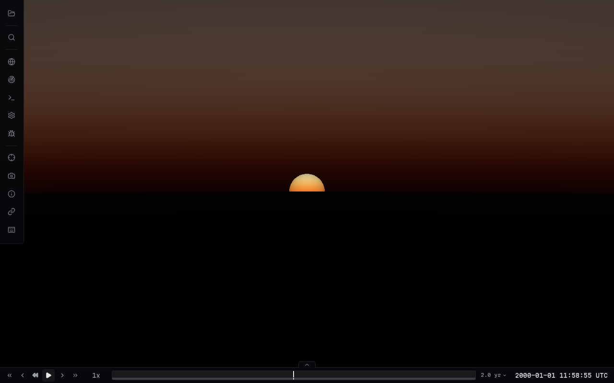
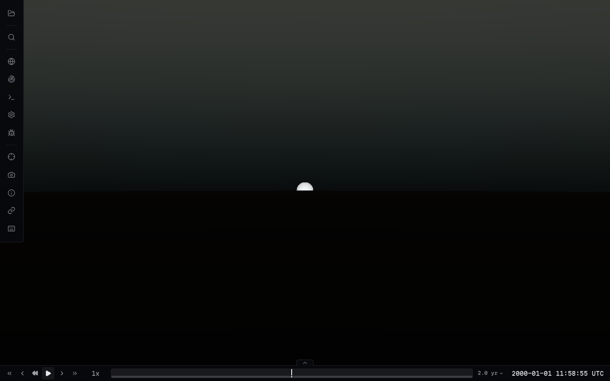
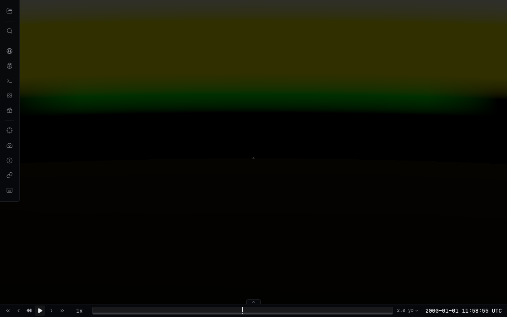
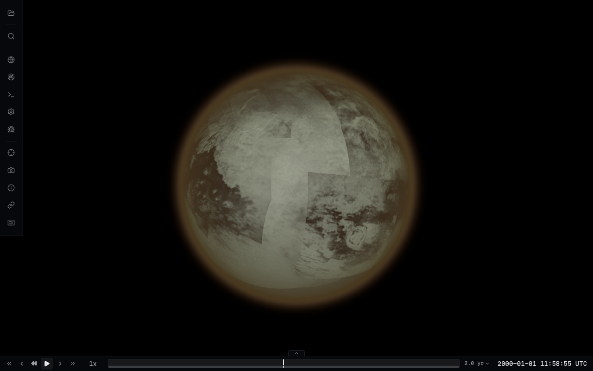
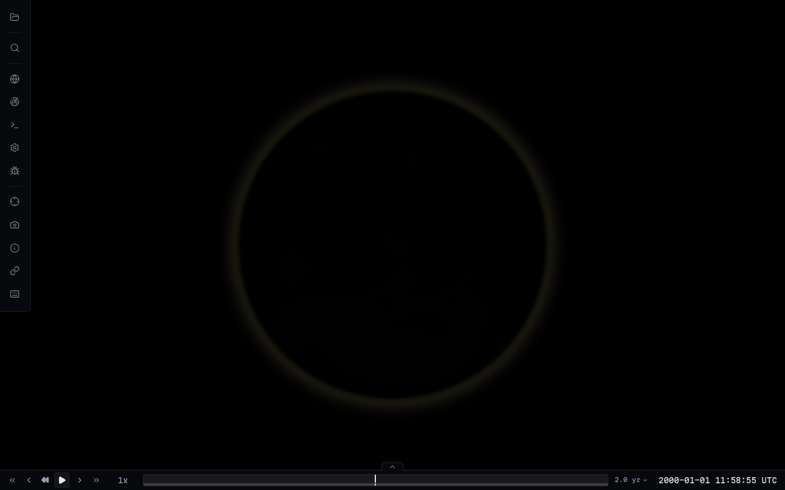

# Solar photosphere and optical glare

The catalog body named `Sun` uses `SunVisual` rather than a yellow, textured
emissive body. Other stars retain their existing material and texture path. The physical
sphere remains in the normal body positioning, picking and tracking system, at
its catalog radius even when `minBodyPixels` is nonzero.

The disk uses a broadband linear limb-darkening profile, `0.4 + 0.6 * mu`, and
warm-white linear HDR radiance `(3.2, 3.08, 2.88)`. `mu` is the normal/view cosine
at the actual sphere surface, including perspective at close range. Direct solar
and scattered atmospheric radiance share the display response
`0.94 * exposedRadiance / (1 + exposedRadiance)`, with one observer exposure
for the disk, atmosphere shells, and terrain aerial perspective. The resolved disk applies its limb profile after
that response to preserve visualization contrast; atmospheric attenuation uses
the same response as sky light. Low-contrast procedural granulation
fades in between 512 and 1400 physical pixels, with derivative filtering to avoid
aliasing. It is illustrative surface detail, not an epoch-specific observation,
and does not affect the HDR source used for glare.

`SOLAR_LAYER` draws the disk after atmosphere shells while retaining the opaque
body depth buffer. The nearest intersected atmosphere supplies its existing RGB
transmittance LUT and density profiles; transmission is applied before both the
disk response and optical glare. This avoids attenuating the disk twice. The
numerical profile integration remains available when no LUT exists.
Direct transmission is extinction only (`atmRayTransmittance`), with no
reference-sphere shadow. The rendered body/depth buffer defines the resolved
horizon. Rays below the transmittance LUT's reference horizon integrate density
numerically rather than querying a binary analytic shadow. Scattering samples
retain their physical planet shadow through `atmSunTransmittance`.
The main scene draws bodies/atmosphere, then the solar disk, then layer-2
trajectory and sensor overlays without clearing depth between those passes.
Foreground overlays retain their final presentation; overlays behind the Sun
fail the solar depth test. Each dedicated pass restores the camera layer mask
before the existing surface-tile and model passes.

`SunGlareEffect` renders only solar radiance into a half-float source target.
A separate proxy scene contains the Sun and intersecting opaque body bounds;
model meshes are inspected only for intersecting model bodies. Terrain and surface
tile hierarchies are represented by their body's physical globe in this optical
pass. The host scene is never traversed or its materials swapped in production.
Opaque proxies contribute depth and black color; transparent shells, overlays,
lines, sprites, stars and other emissive content contribute no light. A bounded
quad composites two spatial Gaussian blurs of the source at half resolution: a
compact halo and a much fainter tail. Both retain the original occultation and
atmospheric transmission mask, so a rising Sun cannot produce a circular halo
around its hidden lower half. Their width is capped, so close-up solar views do
not grow a huge halo. The response suppresses glare over the luminous disk to
preserve its photospheric gradient. Only the unresolved point uses a 1x1 HDR
reduction of 32 equal-area samples to estimate total visible flux.

Between sixteen and four physical pixels, the display disk smoothly transfers into a
point spread. An expanded *offscreen optical source* preserves subpixel energy,
scaled by the inverse footprint area. The physical sphere is never enlarged.
For that optical footprint, original solar rays are also tested against up to
eight nearby sphere/ellipsoid occluders so a tiny fully occulted Sun cannot leak
glare around the edge of a similarly tiny planet.

The viewer's existing bloom toggle controls solar glare, and bloom strength
scales its halo. Generic bloom still handles other emissive content and skips its
scene/blur passes when that layer is empty. Solar glare skips its source pass
when the Sun and halo are outside the viewport.

This is an adapted-exposure visualization, not calibrated photometry. It uses the
first atmosphere crossed on the viewing ray; simultaneous transmission through
multiple planetary atmospheres and eclipse corona are outside this first pass.
The 32-sample quadrature approximates partial-disk optical flux rather than
simulating a full camera PSF. The two separable blurs use nine taps per axis,
scissored to the Sun and halo bounds to keep small-source views inexpensive.
Source rendering and clearing are also scissored; clearing includes the previous
footprint to prevent stale texels after camera motion.

## Relative radiance and preset audit

`SolarRadiometry` supplies one photospheric center radiance and derives incident
irradiance as `centerRadiance * 0.8 * pi * (solarRadius / distance)^2`. The 0.8 is
the disk integral of the limb profile. Shell single/multiple scattering and
terrain aerial-perspective inscatter use that irradiance instead of an unrelated
unit light source. Both LUT and numerical shell paths apply the shared display
response; the HDR optical source remains linear. This establishes a common
direct-source/sky convention without introducing a low-altitude solar gain.
Exposure is the inverse red-channel solar irradiance at the observer. This
matches the viewer's normalized surface lighting: outer-system textures remain
normally lit, so their atmospheres must not become disproportionately dark.
Physical HDR irradiance still falls with distance squared; exposure affects only
the shared display response. The same exposure applies to direct sunlight and
scattered light, rather than adding a low-altitude Sun-only gain.
It is a scoped relative-unit visualization, not a scene-wide HDR compositor or
an absolute luminance calibration of every existing body material.

Venus's former red-heavy Rayleigh/absorption coefficients were atmosphere-color
tuning that produced an inverted direct filter. They now increase toward blue.
Titan retains its original effective broad-angle tholin scattering preset.
These coefficients represent legacy haze tuning rather than isolated molecular
Rayleigh; together with blue absorption, its total extinction already reddens
direct sunlight. Replacing that tuning changed its orbital color and phase
appearance unnecessarily. Earth keeps its wavelength-dependent
Rayleigh and ozone profiles. Mars retains colored dust scattering/extinction,
which can physically favor blue direct sunlight. These remain approximate
presets rather than measured wavelength-resolved atmosphere models.

## GPU verification

```sh
npm run build
node scripts/test-sun-gpu.mjs
# Or use an installed browser:
CHROMIUM_PATH=/usr/bin/chromium node scripts/test-sun-gpu.mjs
CHROMIUM_PATH=/usr/bin/chromium node scripts/test-sun-viewer-gpu.mjs
```

The check needs Chromium but no viewer assets or SPICE kernels. It tests limb
darkening in both distant and close views, neutral color, HDR values, compact
glare, spatial masking of partial occultation and sunrise, resolved and subpixel total
occultation, atmospheric dimming/reddening of the disk and glare, agreement
between LUT and numerical transmission, unresolved visibility, exclusion of
other content, physical radius, and restoration of scene/renderer state.
Captures are written under `work/sun-rendering/`.

The viewer integration check runs the actual `UniverseRenderer` with Earth's
atmosphere, a streamed GLTF surface tile, and a 256-mesh GLTF model. It checks
visible tile and atmosphere pixels, solar-to-tile camera layer restoration, and
the size of the explicit solar occluder set and scissored source region. It also
uses the production `TrajectoryLine` and `SensorFrustum` materials to check
foreground content crossing the solar disk and occlusion behind it, comparing
rendered pixels against an overlay-free frame. It
also approaches the coarse Earth globe's horizon at three viewing angles, using
a zero-extinction atmosphere to isolate geometric visibility. Every visible
solar pixel must match the atmosphere-hidden reference depth boundary; this
explicitly catches a second analytic horizon even when density is zero. It
reports warm-frame and glare timings with synchronous software WebGL; these
are fixture measurements, not hardware GPU performance estimates.
In the 768×512 reference run, the 256-mesh fixture uses one solar source proxy
and a 126×126 source region (4.04% of the target).

The same production check renders Titan from the front and back at both 1 AU
and 9.5 AU. A black surface isolates scattered haze from surface lighting.
Front-disk and back-limb output pixels must remain visible and match within
three channel levels between distances, while HDR irradiance still decreases
by more than 80×. This catches the outer-system exposure regression that a
1 AU sunrise capture missed.

These images are synthetic GPU scenes using the production shaders, not
mission-epoch or solar-surface imagery. The horizon example deliberately uses a
large disk to expose transmission gradients and ground masking.

### Resolved disk in space


### Through Earth's atmosphere


### Partial occultation


### Close resolved disk


### Large photosphere


### Viewer atmosphere and surface tiles


### Trajectory and sensor overlay depth



## Running viewer reference captures

These four images come from the running Svelte viewer app with its UI, bloom
enabled, and the production renderer. The self-contained fixed-point catalog
preserves the physical Earth/Sun radii, uses 1 AU solar distance, and places the Sun at Earth's spherical
horizon for the final view. Space apparent sizes are set by camera distance.
This is a reproducible visual reference rather than an epoch-specific SPICE
scene or a golden-image test. The photosphere/granulation mapping is unchanged.

```sh
npm --prefix apps/viewer run dev
# In a second terminal, after the server is ready:
CHROMIUM_PATH=/usr/bin/chromium node scripts/capture-sun-viewer.mjs
```

The script writes screenshots and camera poses to `work/sun-rendering/`.
The committed [reference poses](images/sun-app-reference-poses.json) record the
actual apparent sizes, camera positions/targets in km, FOV, and drawing buffer.
The sunrise camera is 10 km above Earth's surface at an 8° FOV. Its globe uses
1024×512 tessellation to avoid coarse polygon facets dominating the horizon;
the physical radius and atmosphere are unchanged. The direct disk remains
brighter than neighboring sky under the shared radiance/display convention.

### 150 px Sun in space



### 35 px Sun in space



### 5 px optical transition



### Near-surface sunrise



### Venus, Mars and Titan checks

```sh
SOLAR_REFERENCE_PRESET=Venus CHROMIUM_PATH=/usr/bin/chromium node scripts/capture-sun-viewer.mjs
SOLAR_REFERENCE_PRESET=Mars CHROMIUM_PATH=/usr/bin/chromium node scripts/capture-sun-viewer.mjs
git lfs pull -I apps/viewer/test-catalogs/textures/titan.dds
SOLAR_REFERENCE_PRESET=Titan CHROMIUM_PATH=/usr/bin/chromium node scripts/capture-sun-viewer.mjs
```

These reference views use the physical Sun at 0.72 AU (Venus), 1.52 AU (Mars),
and 9.5 AU (Titan), with cameras at 50 km, 10 km, and 200 km respectively, where
direct sunlight is visible through each model. `SOLAR_REFERENCE_AU` overrides
the solar distance for comparisons. Each script checks the displayed Sun's luminance
against adjacent sky and the absence of inverted blue filtering for
Earth/Venus/Titan. Mars's moderate blue direct filtering is retained.

| Preset | Sun RGB | Adjacent sky RGB |
| --- | --- | --- |
| Earth | 241, 241, 222 | 32, 21, 5 |
| Venus | 240, 177, 89 | 22, 3, 2 |
| Mars | 236, 240, 241 | 10, 14, 14 |
| Titan | 58, 59, 57 | 0, 0, 0 |

These are sampled output pixels, not physical radiance measurements. The camera
poses and sample coordinates are reproducible through the capture script.








### Titan orbital atmosphere at Saturn's distance

The front and back views use the catalog Titan DDS surface map and the restored
haze preset at 9.5 AU. The front view preserves haze over the visible surface;
the back view retains its atmospheric limb. These are fixed reference poses,
not mission-epoch scenes. [Titan camera poses](images/sun-app-titan-reference-poses.json)
record solar distance, camera geometry, and drawing buffer.




