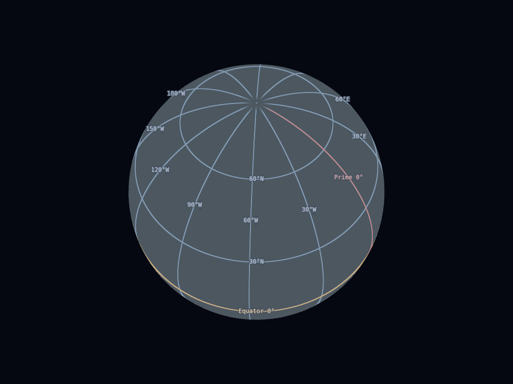
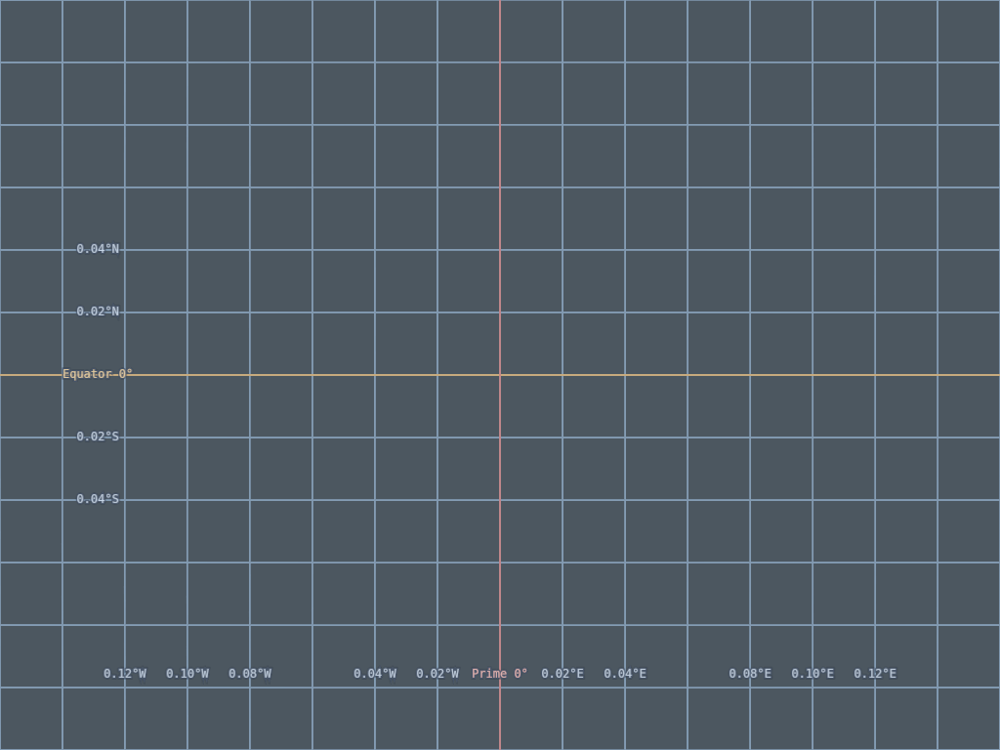
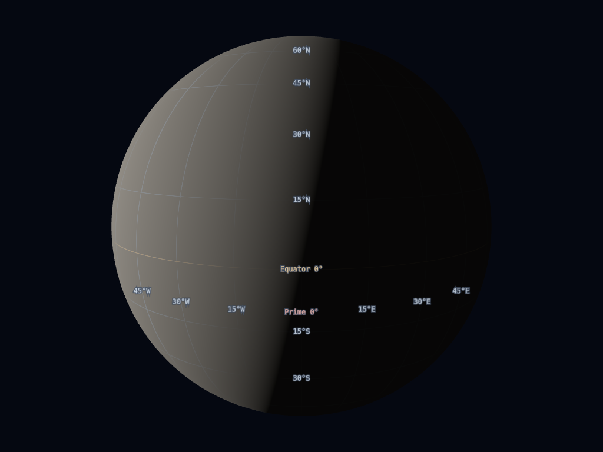
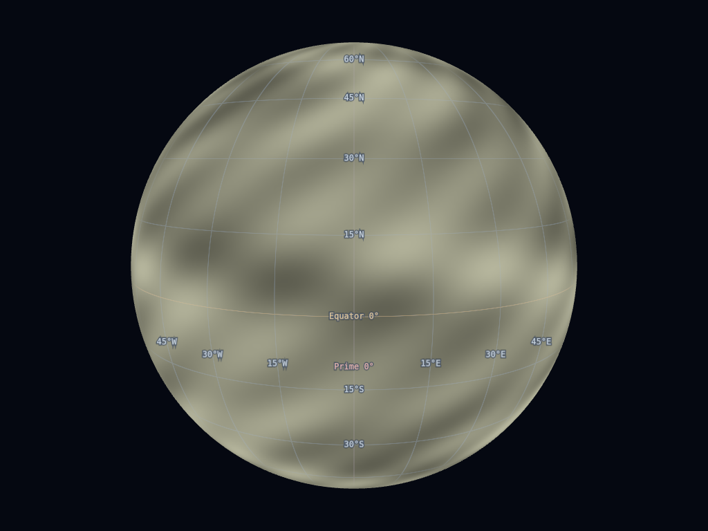
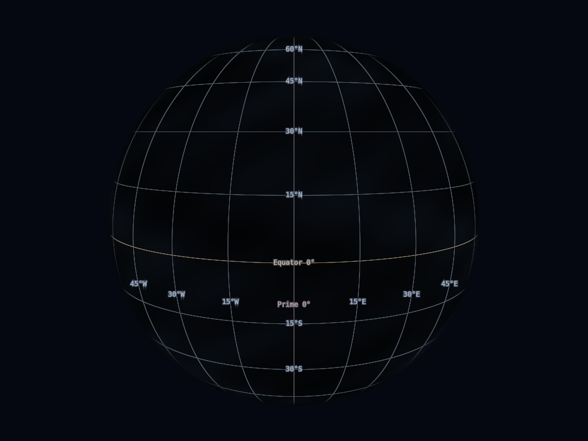

# Issue 157: graticule implementation and validation

The production path is a procedural graticule in surface materials. Coordinates
come from physical body-fixed position and the declared reference shape, using
the same core conversions as terrain sampling, Point Probe and surface navigation.
The grid never uses display-radius fallbacks or a radius-inflated shell.

Spheres and rotational ellipsoids use geodetic latitude; triaxial globe reference
ellipsoids use planetocentric latitude. Longitude is east-positive and wrapped to
[−180°, 180°). Labels include E/W. The frame is the rotation model’s declared target frame when supplied (including
SPICE rotations), otherwise `BODY_FIXED:<name>`; this does not invent an IAU
frame for a catalog without one. Grid transforms use
`BodyMesh.bodyToWorldQuaternion`, including the no-rotation case, and do not
inherit model mesh pre-rotation. Placeholder bodies, stars, spacecraft,
barycenters, exaggerated minimum-pixel bodies and mesh bodies have no grid.

Density uses a fixed screen sampling lattice and local latitude/longitude
projection derivatives, rather than the whole-body diameter. Independent nice
steps range from 30° to 0.001°, with a 60–180 px hysteresis band around a tunable
100 px target. Level changes crossfade over 180 ms. Fragment derivatives provide
antialiasing, suppress subpixel lattices and congested polar meridians, and handle
the longitude seam by differentiating its unit vector. Equator and prime meridian
use restrained accent colors. Major/minor/reference strengths are 22% / 7% /
35% before lighting, density and horizon modulation. Widths remain in CSS pixels;
night-side intensity is reduced without treating dark daytime albedo as night.
Minor lines are optional.

Coordinate labels stay 12 CSS px, with DPR-aware rasterization. Candidates come
from a pose-dependent layout and are bounded at 96 per body and 24 pooled sprites.
Whole-globe latitude labels share a fixed meridian; longitude labels share a
fixed latitude band capped at ±50° to avoid polar congestion. Bands change in
coarse angular sectors with fades rather than following every camera movement.
Regional curves are labelled along one usable viewport edge per axis, preferring
left/bottom when those edges cross the curves. Density and line discovery run at
150 ms intervals; current line/edge intersections update every frame.
Placement blends along the coordinate line over altitudes of 0.65 to 0.15 reference
radii above the surface. A clipped globe alone does not trigger edge placement.
Edge hysteresis persists during motion; after 250 ms without camera motion,
canonical edge selection converges to the settled pose. Relocations fade before
changing anchors, and density retirements fade when visibility remains safe. Labels have a consistent 8 CSS-pixel inward offset.
Collisions suppress lower-priority annotations within that layout. Equator and
prime meridian annotations read `Equator 0°` and `Prime 0°`.
Labels use the existing LabelManager
reservations and yield to body labels, event callouts, and host measurement/probe
reservations. The viewer's measured rail, timeline, panel and HUD rectangles
reserve annotation space; edge margins also inset around the rail and timeline.
Point Probe reserves its visible panel. Surface normals and
reference intersections suppress the far side/horizon; terrain intersections
check the actual surface anchor and its association with the labelled line.
Billboard glyphs use the body-label overlay convention after CPU anchor occlusion;
surface/grid depth testing remains enabled. Terrain/other-body triangle queries
are limited to eight per body per frame. Current visible anchors receive fair,
oldest-first rechecks; deferred hits remain usable for at most 150 ms and an
8 CSS-pixel projected move. Horizon/viewport checks run every frame, and surface
load/disposal invalidates the cache. Hits stay in physical body coordinates.
Cached triangle hits provide visibility evidence, never a stale moving sprite
position: current coordinates plus resident height (or cached overlay height)
keep annotations on their labelled lines each frame.

Display preferences, camera JSON and script snapshots carry scope, pinned bodies,
per-body visibility/labels, Auto/manual density, labels and minor lines. `G`
remains the master switch; tracked-body scope is the default. Explicit targets
are independent of selection. The optional-body renderer visibility path remains
available and stores configuration before a body mesh is loaded.
Free-look retains the scene-origin body's grid until another body becomes the
focus. Density planning uses nearby resident elevations when available, including
depressions below the reference ellipsoid. It solves a nearby entry intersection
with at most six elevation refinements, without taking a far reference-surface
exit, tracing terrain triangles or requesting data.

## Rendering comparison

The asset-free harness compares the original implementation at
`8d685f73f94cab63bca54d4d16c6eee909a2a89a` with the new path. It also builds a
bounded CPU-sampled draped-line prototype over a synthetic resident height grid:
0.5 px projected chord-error refinement, depth ≤10, ≤4096 segments, and no fetches.
The same synthetic rendered mesh is used for the shader and line captures.

Draped geometry needs resident elevation data, rebuilding/cache invalidation,
refinement budgets, and clearance between its sampled surface and rendered LOD.
The prototype remains naturally depth-tested and demonstrates gaps where CPU
samples differ from the rendered triangulation. The shader follows every
rendered fragment without extra line buffers, terrain queries for lines, or
additional tile requests. It composes with existing imagery, shadow and
atmosphere shader hooks. Tile materials retain their identity for upstream fade
tracking and eviction. A camera-to-body uniform combines with Three.js's
per-object model-view matrix, including objects sharing a material;
local overlays preserve body-fixed semantics in the camera-relative pass. Labels
render in the final annotation scene after terrain/local overlays; density and
visibility update after the current camera and terrain updates.
Oblate latitude conversion has a bounded eight-iteration cost; spheres bypass
that conversion. Skirts and transitions inherit the rendered mesh's physical
coordinates. CPU elevations remain a separate analytical authority.

The shader is therefore the chosen production path. Reference-globe and
rendered-terrain semantics are explicit; no terrain conformity is claimed for
an unloaded reference globe or an irregular mesh. DSK draping and general
triaxial geodetic coordinates remain unavailable.

The final matched 0.5° synthetic line-only comparison has no labels in either
path. The shader uses one surface draw and zero extra grid geometry; the draped
prototype adds a draw, 192 segments / 4,608 bytes, and 1,080 resident CPU samples,
with 0.5 px refinement and maximum depth 4. Its one-time construction took
43.7 ms in this run; both steady frame medians were about 0.2 ms. This supports
the registration/memory decision, not a claim that every shader frame is faster.

| Fixture | Before calls | After calls | After step | After candidates / labels | After median update / frame |
| --- | ---: | ---: | --- | --- | --- |
| Whole Moon | 35 | 9 | 30° / 30° | 44 / 8 | 0.1 / 0.3 ms |
| Regional Mars | 22 | 13 | 0.2° / 0.2° | 96 / 12 | 0.2 / 0.5 ms |
| Synthetic terrain with labels | 22 | 15 | 0.5° / 0.5° | 96 / 14 | 0.2 / 0.4 ms |

All captures report zero grid-triggered requests. The raw metrics are the
source of truth for timings, geometry/texture counts and other views. The 24
PNGs include 11 comparable before/after pairs and two matched terrain prototypes.

## Reproduce

Run the viewer Vite server in one terminal:

```sh
npm --prefix apps/viewer run dev -- --host 0.0.0.0
```

Then run:

```sh
node scripts/graticule-validation.mjs
```

`CHROMIUM_PATH`, `GRID_VIEWER_URL`, `GRID_BASELINE_REF` and `GRID_CAPTURE_DIR`
can override defaults. The harness generates and removes a temporary baseline
module/HTML page. PNGs are comparable before/after views; `metrics.json` contains
draw calls, geometry/texture counts, candidate/label counts, chosen spacing,
CPU update and frame timings, plus draped-prototype memory/refinement statistics.
Timings use headless Chromium SwiftShader and `gl.finish`, and are development
fixture measurements, not hardware GPU or live terrain streaming claims.

## Layout and navigation review

With the same local Vite server, run:

```sh
node scripts/graticule-layout-validation.mjs
```

[Layout review captures and metrics](layout-review/metrics.json) cover an oblique
polar globe, a south-pole view, regional Mars, a globe-to-regional transition,
free-look through actual pointer input and camera/grid synchronization, and the
same final pose reached through two different camera paths at fixed spacing.
The final annotations in those two paths are identical. Longitude labels share
one band on globe views; regional annotations use consistent viewport edges.

The synthetic resident depression has a 100 km reference radius and terrain at
99 km. A camera at 99.5 km produces 22 candidates, 16 visible labels and 0.02°
latitude/longitude spacing. Its terrain patch and CPU elevations agree; the
capture verifies nearby surface planning and rendered anchor registration.

| Oblique polar globe | Below-datum regional view |
| --- | --- |
|  |  |

The review run has eight captures, zero browser/shader errors and zero
grid-triggered requests. Regression tests cover free-look target lifetime,
resident below-datum planning, globe/polar bands, regional edges, distinct zero
annotations, camera-path independence and the earlier visibility/material
lifecycle findings. All 141 suites / 1,563 tests pass, as do typecheck, lint
and purity checks. These remain synthetic fixtures; the generated streamed
terrain products listed below are still required for live acceptance.

## Continuous motion review

With the same Vite server, Chromium and FFmpeg installed, run:

```sh
node scripts/graticule-motion-validation.mjs
```

[Orbit → zoom → pan → tangent recording](motion-review/orbit-zoom-pan-tangent.mp4)
uses a fixed 30 Hz application clock and encodes every rendered frame. This
preserves intermediate frames between the 150 ms discovery plans even when
SwiftShader renders slower than playback. It is an offline motion validation,
not a real-time performance claim. The camera moves continuously over 15 seconds;
[frame diagnostics](motion-review/frames.json) retain physical coordinates,
projected positions, opacity and label rectangles throughout the sequence.
The rendered sequence contains 451 frames, including 90 pan frames; every
pan-frame equator intersection changes while line error stays below 10⁻¹²°.
There are zero control overlaps, browser/shader errors or grid requests.

The acceptance check requires line error below 0.000001°, continuously changing
regional equator intersections during pan, no rectangle overlaps with measured
mock rail/timeline controls, and the existing 24-label / 96-candidate bounds.
[Motion metrics](motion-review/metrics.json) report the results and actual CPU
update timings. Separate captures exercise a directional-light day/night split
and synthetic bright/dark surface imagery.

| Day/night surface | Bright imagery | Dark imagery |
| --- | --- | --- |
|  |  |  |

The latest full suite passes all 141 suites / 1,565 tests. Added regressions
check placement on consecutive 16 ms frames, a clipped globe retaining fixed
bands, regional intersections inset around actual control rectangles, edge
hysteresis during camera roll, convergence after settling through different
paths, and density blending starting from the previous level without a flash.
These captures remain synthetic; streamed terrain acceptance is still pending.

## Coverage and limits

Captured: whole Moon/Earth, oblique hemisphere, away from prime meridian/equator,
south pole, antimeridian, Jezero-coordinate regional Mars, bright/dark surfaces,
a 390×844 DPR2 viewport, and synthetic rendered-terrain shader/draped comparison.
The harness finishes with no browser/shader errors.

Automated fixtures cover sphere/oblate/triaxial coordinate round trips,
east/west conversion, wrapping/formatting, frame/model rotation, density
hysteresis/bounds, regional refinement, per-body/master visibility and complete
saved-state script replay. Typecheck, lint and purity checks pass.

Review regressions additionally exercise continuous 0.001 km camera movement
over a triangle-backed terrain fixture, the eight-ray budget, large view changes
and cached-hit expiry. Integration fixtures use the actual upstream
`TilesFadePlugin` material manager and `TilesRenderer.disposeTile` to verify
fade completion and material disposal when enabling the grid on resident tiles
and when loading tiles with the grid already enabled.

After the review fixes, `npm test -- --maxWorkers=2` passes all 140 suites /
1,560 tests; typechecking, lint and purity checks also pass. The browser harness
was rerun for all 24 captures with zero browser/shader errors and zero
grid-triggered requests. [Review metrics](review-metrics.json) record that run;
[the updated synthetic-terrain capture](review-synthetic-terrain-after.png)
shows the shader using preserved tile material identities. The initial
comparison metrics and captures above remain available for reference.

The initial full run failed because SPICE kernels were LFS pointers. Restoring
the existing cached objects resolved those failures:

```sh
git lfs pull --include='kernels/fixtures/**,packages/spice/test-kernels/**' --exclude=''
git lfs pull --include='apps/viewer/test-catalogs/kernels/**' --exclude=''
```

The changed renderer/control/viewer paths and core coordinate fixtures pass 713
tests. A main-viewer smoke capture with textured Earth and atmosphere also
confirms material composition and matching Point Probe coordinate metadata
(`viewer-earth-textured.png`). The browser's only resource error was a missing
favicon, with no shader or application errors.

The high-concurrency full run passed 1,555 tests and exposed one existing
100 ms progress-throttle timing assertion in `gf-reporting.test.ts`; its 24-test
suite passes in isolation. `npm test -- --maxWorkers=2` passes all 139 suites / 1,556 tests.

Actual streamed lunar/Mars terrain, Shackleton imagery, natural/flood-light
terrain, streamed mixed-LOD transitions, ground/tangent views and
selected-event/measurement collision screenshots still require the generated
terrain products (`moon-terrain-fused`, `mars-terrain-fused`, etc.), which are
absent from this workspace. The synthetic captures do not substitute for those
remaining acceptance checks. General mesh-body reference grids are explicitly
unavailable.
